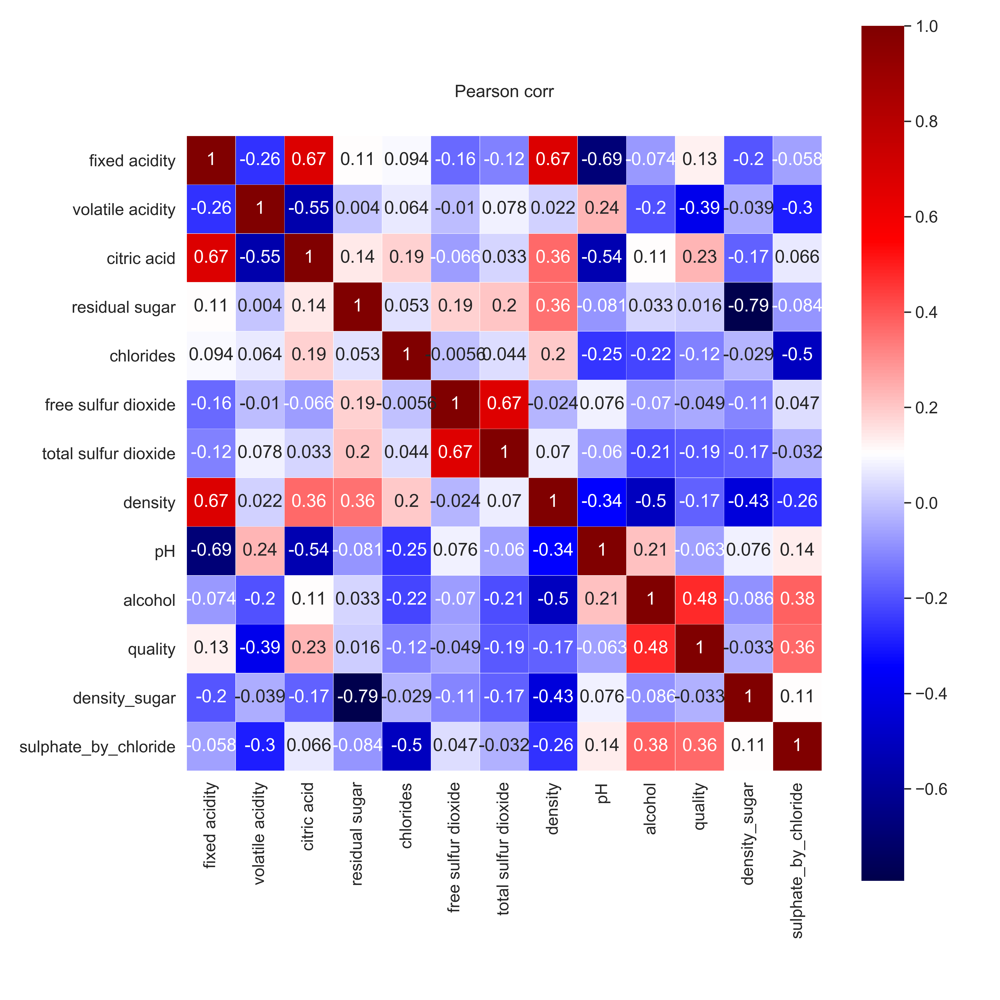
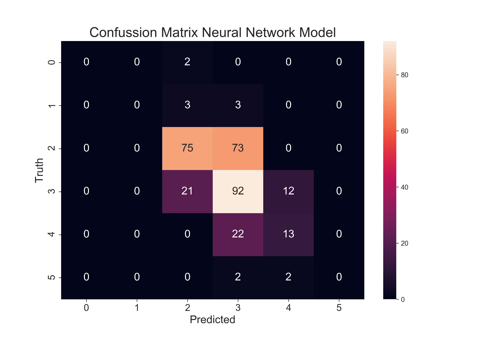

# Predicting red wine quality.
Supervised Multi-classification ML problem -> Predicting wine quality

In this project we will tackle a multi-classification problem using supervised ML on a well known dataset about red wine quality. See [here](https://www.kaggle.com/sh6147782/winequalityred). This dataset contains quality parameters for 1596 red-wines, which we can use to build a model that predicts red wine quality.
 
 # Code and Resources Used

**Python Version**: 3.7

**Packages**: pandas, numpy, sklearn, matplotlib, seaborn, random.

*Next the steps used in this proyect are summarized. Note that in this case the dataset is clean and ready to go to this is a simplified project since two of the major steps in a ML projec are not needed (Data collection and Data cleaning)*
..

# 1. Visualize the data:
Observe how the targets are distributed in our dataset. Analyze the attributes and perform some feature engineering.

 

# 2. Split the data.
Based on the value distribution of the targets (see below) we **stratifyed** the dataset to obtain same distributions after splitting the data into the test and train sets.

# 3. Preprocess the training data.
Data distribution was checked using histograms for each attribute and based on their skewness and sparse scales  **standarization** of the train and test set was carried out.

 

# 4. Evaluate different algos.
For this purpose cross validation was performed using the f1_micro score and stratifiedKFold.

**Model Performance Comparison**
(Model Name - Score):
* LogisticRegression(LR) - 0.592
* BaggingClassifier- LR (BC_LR) - 0.590
* SGDClassifier(SGD) - 0.498
* GaussianNB(GNB) - 0.542
* KNeighborsClassifier(KNC) - 0.581
* DecisionTreeClassifier(CART) - 0.589
* AdaBoostClassifier -CART(AB-CART) -0.580
* RandomForestClassifier(RFC) - 0.672
* ExtraTreesClassifier(ETC) - 0.671
* Support Vector Machine Classifier(SVC) - 0.607
* BaggingClassifier - SVC(BC_SVC) - 0.601
* GradientBoostingClassifier (GBC) - 0.610
* ExtremeGradientBoost(XGB) - 0.626
    
              

SVC, RFC, ETC and XGB were chosen for further tunning and to generate a final ensemble model using a **soft voting classifier** approach.

# 5. Fine tune:

SVC, RFC and ETC were tunned using GridSearchCV with a score f1_micro score and stratifiedKFold to obtain a satisfactory accuracy in both the train a test set, while avoiding overfitting.

# 6. Ensemble model 

SVC, RFC and ETC tunned models were used to generate an ensemble model using Sotf VotingClassifier. 

# 7. Model Evaluation:

The final model was evaluated against the test set by looking at the f1_score, confussion matrix, ROC curve and AUC values for each target class and feature importance.

An accuracy of 0.64 was achieved in the test set. We could observe that there is room for improvement predicting the classes 2 and 3.

  
 
 
Future work to improve the predictive power of this model could be:
 * Gather more training data. In particular for the classes 2 and 3.
 * Include more features either by collecting more data or performing feature enginnering
 * Since our algo struggle particularly in separating the classess 2 and 3, we could consider grouping them both into one "middle quality" category.
 
 * Also, what about using neural networks to solve thi classification problem? I explored this option in a last section of this project.
 
 # 8. Designing a Neural Network (NN):
 
 * A NN composed of 7 layers was designed to tackle this classification problem:
   * 1 x Input layer: Shape = 8
   * 4 x Dense layers: Composed of 300, 200, 100 and 50 nodes respectively, Activation function = Selu, kernel_initializer='glorot_uniform' and L2 regularization (0.01) 
   * 1 x Dropout layer for further regularization.
   * 1 x Output layer: 6 nodes with activation="softmax"
   
 After compiling and training the model we obtained the following results upon the test set as summarized in the confussion matrix of the NN (left), compared to the results obtained on the ensemble model (See figures below).
 
      
 
 We can see that our NN did not perform as well as our previous ensemble model.
