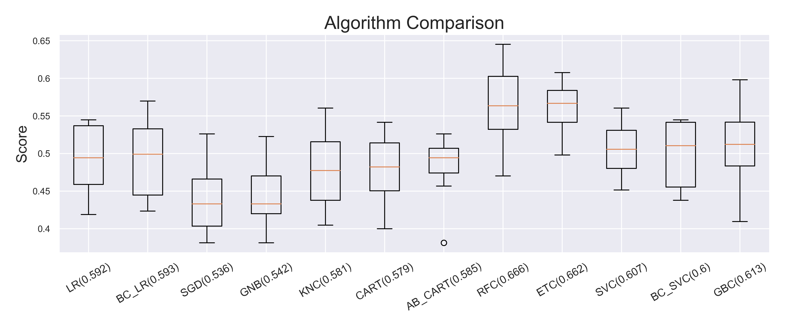
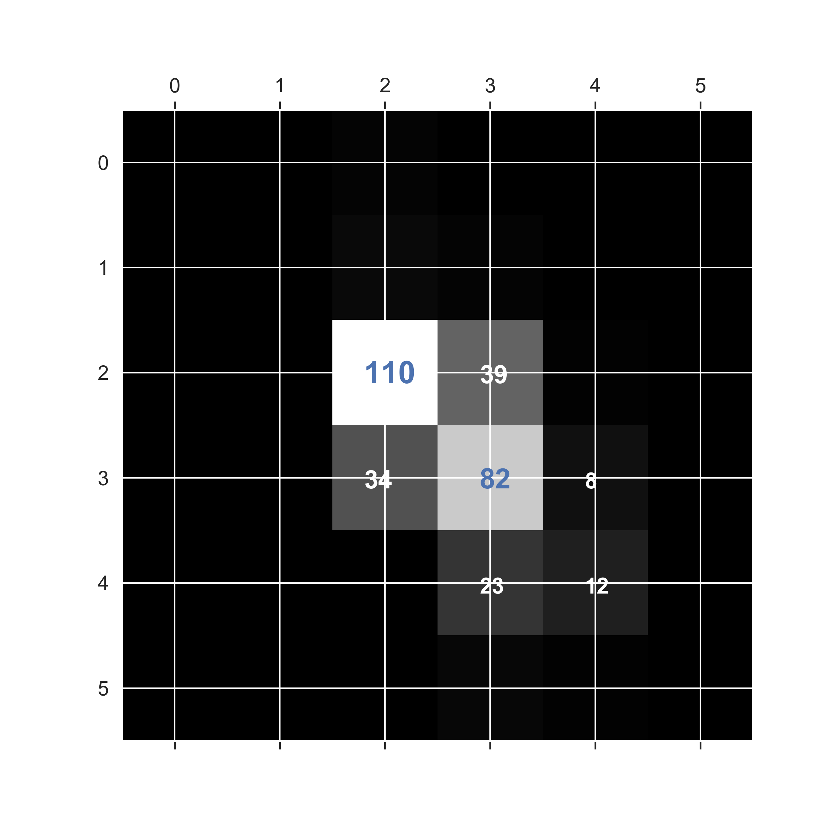
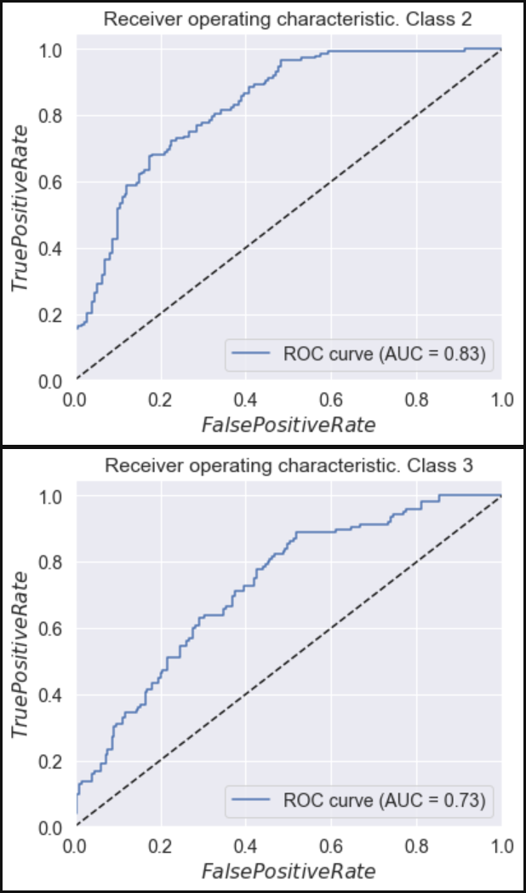

# red_wine_quality
Supervised Multi-classification ML problem -> Predicting wine quality

In this project we will tackle a multi-classification problem using supervised ML on a well known dataset about red wine quality. See [here](https://www.kaggle.com/sh6147782/winequalityred). This dataset contains quality parameters for 1596 red-wines, which we can use to build a model that predicts red wine quality.
 
 # Code and Resources Used

**Python Version**: 3.7

**Packages**: pandas, numpy, sklearn, matplotlib, seaborn, random.

*Next the steps used in this proyect are summarized. Note that in this case the dataset is clean and ready to go to this is a simplified project since two of the major steps in a ML projec are not needed (Data collection and Data cleaning)*
..

# 1. Visualize the data:
Observe how the targets are distributed in our dataset. Analyze the attributes and perform some feature engineering.

 

# 2. Split the data.
Based on the value distribution of the targets (see below) we **stratifyed** the dataset to obtain same distributions after splitting the data into the test and train sets.

# 3. Preprocess the training data.
Data distribution was checked using histograms for each attribute and based on their skewness and sparce scales  **standarization** of the train and test set was carried out.

 

# 4. Evaluate different algos.
For this purpose cross validation was performed using the f1_micro score and stratifiedKFold.

**Model Performance Comparison**: 

# 5. Fine tune:
SVC was the most promissing and it was fined tuned using GridSearchCV with a score f1_micro score and stratifiedKFold.

# 6. Model Evaluation:
The fine tuned SCV model was evaluated against the test set by looking at the f1_score, confussion matrix, ROC curve and AUC values for each target class and feature importance.

     
